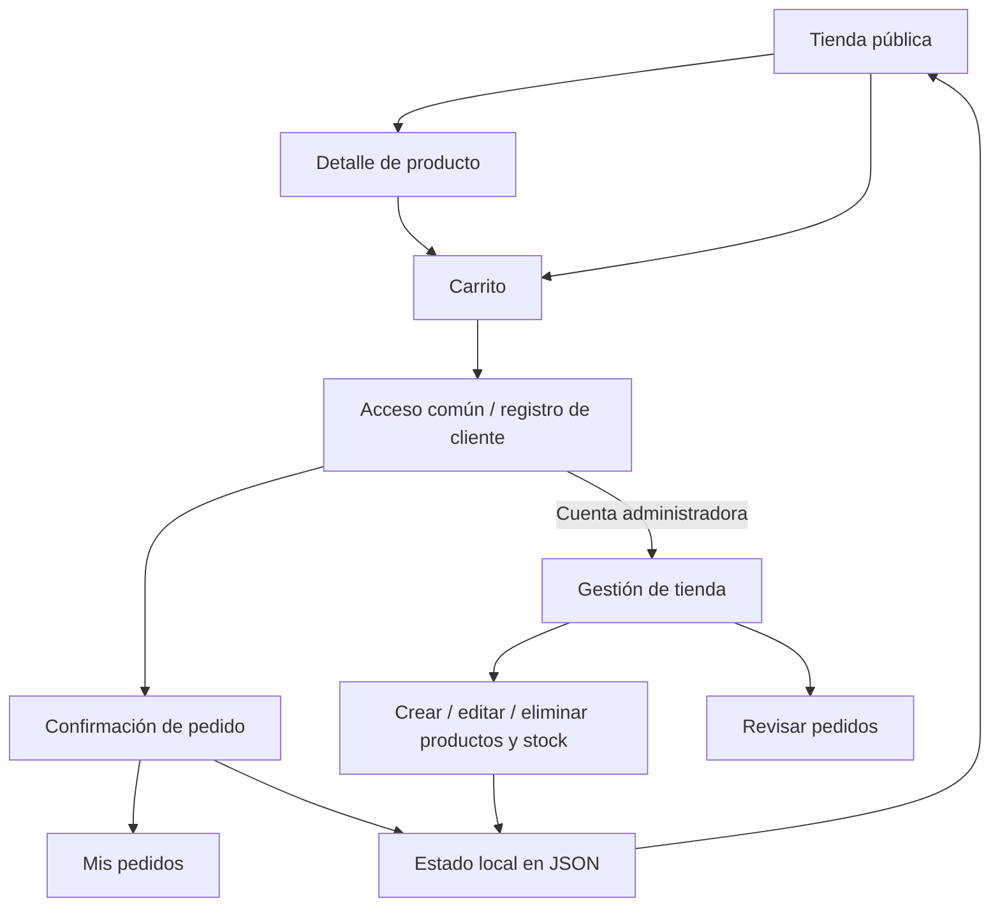

# Arquitectura de la tienda El Tornillo

## Contexto y alcance

La ES1 exige Django, 40 productos de ferretería cargados desde JSON en la vista, listado con herencia de templates, detalle por ID, resumen calculado y destacados condicionales. El PDF establece que la base de datos llega en ES2.

A solicitud del estudiante se adelantaron autenticación, carrito y administración de productos. El catálogo y las credenciales tienen origen JSON. SQLite conserva las sesiones y los IDs internos de Django; las contraseñas y roles válidos provienen de `data/usuarios.json`. Esta ampliación debe distinguirse de lo exigido literalmente por ES1. Los pedidos son demostraciones sin pagos ni entregas reales.

## Decisión

Monolito MVT de Django con templates HTML y JavaScript como mejora progresiva. El listado, los filtros, las compras y los formularios también funcionan mediante solicitudes HTML cuando JavaScript no está disponible. El JavaScript mejora la respuesta al agregar al carrito y el ordenamiento.

| Componente | Responsabilidad |
| --- | --- |
| `config/` | Configuración, sesiones, autenticación, CSRF y rutas generales. |
| `catalogo/views.py` | Carga JSON en la vista, filtros, resumen, carrito, autorización y pedidos. |
| `catalogo/forms.py` | Validación de registro, precio, stock y datos de contacto. |
| `catalogo/backends.py` | Autenticación y recuperación de sesiones contrastando credenciales, rol y estado contra JSON. |
| `catalogo/usuarios.py` | Lectura de cuentas y registro con contraseñas visibles para la revisión académica. |
| `catalogo/storage.py` | Lectura del estado local y escritura atómica con exclusión mutua. |
| `catalogo/context_processors.py` | Contador del carrito en todas las páginas. |
| `catalogo/templatetags/` | Formato CLP y selección de ilustraciones referenciales. |
| `catalogo/templates/` | Tienda pública, cuentas, compra y panel administrativo. |
| `catalogo/static/` | CSS responsive, JavaScript y SVG sin dependencias externas. |
| `data/catalogo.json` | Fuente original de 40 productos, conservada para la evaluación. |
| `data/tienda.local.json` | Productos vigentes, siguiente ID y pedidos locales de demostración. |
| `data/usuarios.json` | Credenciales y roles; contiene admin y cliente precreados y los nuevos registros. |
| `db.sqlite3` | Copias internas de usuarios e IDs estables para sesiones y pedidos. |

## Flujo de navegación

## Reglas de compra y acceso

- Los visitantes pueden armar el carrito; solo un usuario autenticado confirma un pedido.
- El carrito guarda IDs y cantidades en la sesión. El servidor consulta precios y existencias actuales, sin aceptar totales enviados desde el navegador.
- Cantidades enteras positivas y stock suficiente se comprueban al agregar, actualizar y confirmar.
- Cuando se elimina un producto o disminuye el stock, el carrito se ajusta y muestra un aviso antes de continuar.
- La confirmación usa un token de sesión y comprueba duplicados dentro del bloqueo. Pedido y descuento de stock se guardan juntos en un único JSON.
- Los pedidos guardan una copia de nombre, precio y cantidad, por lo que las modificaciones posteriores al catálogo no alteran pedidos anteriores.
- Una cuenta de cliente solo puede consultar sus propios pedidos. La gestión comprueba `is_staff` en el servidor para cada vista y operación.
- El registro escribe clientes en `data/usuarios.json` con la contraseña original en texto plano, según lo solicitado para la revisión; nunca acepta permisos administrativos. El archivo ya incluye un administrador y un cliente de demostración.
- `UsuariosJSONBackend` es el único backend de autenticación. Compara la contraseña con el texto del JSON mediante `constant_time_compare` y sincroniza el usuario interno de Django al ingresar. Solo la copia interna de Django guarda un hash; `check_password` permite detectar si la clave del JSON cambió y exigir otro inicio de sesión. Una cuenta presente solamente en SQLite no puede autenticarse.
- En cada solicitud autenticada se relee el JSON: desactivar o retirar la cuenta revoca su acceso; modificar el rol cambia sus permisos; modificar la contraseña invalida la sesión anterior. El rol `admin` habilita `/gestion/`, sin convertir la cuenta en superusuario de Django.
- Las mutaciones se hacen mediante POST y CSRF. La eliminación muestra primero una página de confirmación. Los destinos de redirección se validan contra el host local.

## Persistencia y límites

La vista lee directamente `data/catalogo.json` hasta que existe el estado local. La primera modificación copia los productos al estado local y no altera el archivo original.

`editar_tienda()` coordina las escrituras con un bloqueo de hilo y un bloqueo de archivo (POSIX o Windows), lee el estado vigente, aplica la operación y reemplaza el archivo mediante `os.replace`. Si la operación falla antes de publicar el archivo, se conserva el estado anterior. Los IDs administrativos son crecientes y no se reutilizan al eliminar productos.

Este mecanismo mantiene la demostración ejecutable con las dependencias actuales. No reemplaza el trabajo de ES2: para una tienda desplegada, los productos y pedidos deben migrarse a modelos, migraciones y transacciones de base de datos, y configurarse el entorno de producción.

## Entorno y comprobación

Pipenv conserva las versiones en `Pipfile.lock`; `requirements.txt` permite instalar como exige la pauta. Se ejecuta `migrate` para autenticación y sesiones, `runserver` para el servidor local. Las cuentas precreadas están en `data/usuarios.json` y sus claves de demostración se indican en README; no requieren `createsuperuser`. Las pruebas aíslan sus escrituras para conservar el catálogo y los pedidos del usuario.
